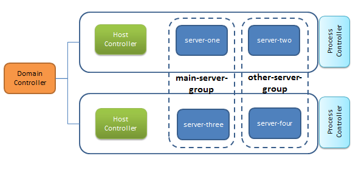
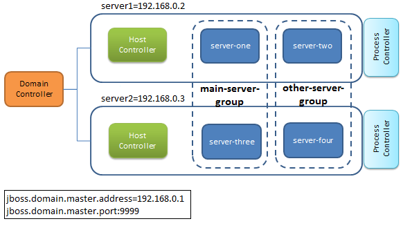

:source-highlighter: coderay
:icons: font

= Legacy WildFly Domain Configuration

This guide discusses how to configure WildFly in **Domain mode** using the legacy configuration, which is valid for installations from version 8 up to version 26.

In WildFly 27 the legacy Domain configuration has been deprecated.

== Configuring WildFly in Domain mode

In order to
understand the domain configuration, we need at first to understand
which are the key components of a domain. A domain is a collection of
**server groups**; a server group is in turn a collection of
**servers**.

TIP: The concept of
server groups can be seen as a set of servers managed as a **single
unit** by the domain. You can actually use server groups for
fine-grained configuration of nodes; for example, each server group
is able to define its own settings such as customized JVM settings,
socket bindings interfaces, or deployed applications.

From
the process point of view, a domain is made up of the following
elements:

* **Domain
Controller**: The domain controller is the management control point
of your domain. An AS instance running in domain mode will have at
most one process instance acting as a Domain Controller. The
Domain Controller holds a centralized configuration, which is shared
by the node instances belonging to the domain.

*  **Host controller**:
It's a process that is responsible for coordinating with a Domain
Controller the life-cycle of server processes and the distribution of
deployments, from the Domain Controller to the server instances.

*  **Application
server nodes**: These are regular Java processes that map to
instances of the application server. Each server node, in turn,
belongs to a Server group.

Additionally, when
starting a Domain, you will see another JVM process running on your
machine: this is the **Process controller**. It's a very
lightweight process whose primary function is to spawn server
processes and host controller processes, and manage their
input/output streams. Since it's not configurable, we will not
further discuss about it.

The following
picture summarizes the concepts exposed so far:

In
the above picture, we have designed a domain made up of a **Domain
Controller**, running on a dedicated server instance and two **Host
Controllers**. The Domain defines two **Server Groups**
(main-server-group and other-server-group which are the default
WildFly server group names); each Server Group in turn contains two
**Servers**, making up a total of 4 WildFly servers.

IMPORTANT: Pay attention on the **Server Group distribution**, which spans
across the two different Hosts. Say main-server-group contains
one block of applications and other-server-group another
block; with the above configuration you will be able to run both
applications **without a single point of failure**.

In
the following section we will show how to create in practice this
Domain configuration by configuring at first configure the Domain
Controller and its **domain.xml** configuration file. Next
we will configure the Host Controllers where your applications can be
provisioned.

=== Configuring the Domain Controller – Part 1: domain.xml

The server
configuration of the domain is centralized in the **domain.xml**
file of the Domain Controller. The domain.xml is located in
the `domain/configuration` folder and it contains the main
configuration that will be used for all server instances. This file
is only required for the Domain Controller. In the domain.xml
file we will define the **server group** configuration (which can
be anyway changed at runtime, as we will see in a minute).
[source,xml]
----

<server-groups>
        <server-group name="main-server-group" profile="full">
            <jvm name="default">
                <heap size="64m" max-size="512m"/>
            </jvm>
            <socket-binding-group ref="full-sockets"/>
        </server-group>
        <server-group name="other-server-group" profile="full">
            <jvm name="default">
                <heap size="64m" max-size="512m"/>
            </jvm>
            <socket-binding-group ref="full-sockets"/>
        </server-group>
</server-groups>
----

WARNING: The above Memory settings are for testing purposes only. In real world scenarios you should use JVM settings in line with your application requirements.

As you can see, we have
defined two server groups: **main-server-group** and
**other-server-group**. Each server group is in turn associated
with a **server** **profile** and a **socket-binding-group**.
The default configuration includes the following pre-configured profiles:

*   **default**:
	Supports the Jakarta EE Web-Profile plus some extensions like REST Web
	Services or support for EJB3 remote invocations. You should
	associate this profile with the "standard-sockets"
	socket-binding-group.

*   **full**:
	supports of Jakarta EE Full-Profile and all server capabilities without
	clustering. You should associate this profile with the
	"full-sockets" socket-binding-group.

*   **ha**: the
	default profile with clustering capabilities. You should associate
	this profile with the "ha-sockets" socket-binding-group.

*   **full-ha**:
	 the full profile with clustering capabilities. You should associate
	this profile with the "full-ha-sockets" socket-binding-group.

*   **load-balancer**:
	this profile can be used to allow one or more servers to act as Load
	balancer for your cluster

[NOTE]
**Quick Recap!**
When running in **Domain mode** you can choose the server
groups configuration among the built-in profiles. When running in
**standalone mode** you can choose the server configuration by
selecting (-c) among the available configuration files.

=== Configuring the Domain Controller – Part 2: host.xml

The other key domain
configuration file is **host.xml** which defines:

*   The application
	servers which are part of a domain server distribution and the
	server group to which they belong.

*   The network
	interfaces and security settings for these application servers

*   The location of
	the Domain Controller

In our example Domain
configuration, there are no application servers running on this host;
this means that we have an host which is dedicated to the Domain
Controller. This is stated by the following empty **servers**
element:
[source,xml]
----
<servers />
----
Next, we need to
specify the location of the **Domain Controller**. Since the
Domain Controller will be running on the same Host, we will include a
"local" element into the domain-controller element:
[source,xml]
----
<domain-controller>

        <local/>// <1>

</domain-controller>
----
<1> This is going to be a Master Controller.

Now we can start the
Domain Controller so that will be bound to the IP Address
192.168.0.1:
[source,shell]
----
$ ./domain.sh -Djboss.bind.address.management=192.168.0.1
----

[TIP]
--
You can choose to start the domain using a
non-standard configuration file by passing the **--domain-config**
parameter. Example :
----
$ ./domain.sh --domain-config=domain-alternate.xml
----
--

Before we move to the Host Controllers configuration, create a Management user to allow the Host Controllers to connect to the Domain Controller.

From the `bin` folder of your Domain Controller execute:

----
./add-user.sh -ds -m -u wildflyadmin -p password1!

Updated user 'administrator1' to file '/home/jboss/domain/master/wildfly-27.0.0.Final/standalone/configuration/mgmt-users.properties'
Updated user 'administrator1' to file '/home/jboss/domain/master/wildfly-27.0.0.Final/domain/configuration/mgmt-users.properties'
To represent the user add the following to the server-identities definition <secret value="cGFzc3dvcmQxIQ==" />

----

Take note of the secret value "cGFzc3dvcmQxIQ==" as we will use it in the next section.

=== Configuring the Host Controllers (host.xml)

After the Domain
Controller is configured and started, the next step is to setup the
two Host Controllers. The Host Controller configuration will download
the Domain configuration from the Domain Controller and use its
**host.xml** file, to define the servers running in it.

TIP: As an
alternative you can name the host file as you like and start the
domain with the the **--host-config** parameter. Example:
[source,shell]
----
./domain.sh --host-config=host-slave.xml
----
The
first thing is to choose a **unique** name for each host in our
domain to avoid name conflicts. So we will choose for the first host
the name "**host1**":
[source,xml]
----
<host xmlns="urn:jboss:domain:20.0" name="host1">

    ...

</host>
----
And for the second host
the name "**host2**":
[source,xml]
----
<host xmlns="urn:jboss:domain:20.0" name="host2">

    ...

</host>
----
Next, we need to
specify that the Host Controller will connect to a remote Domain
Controller. We will not specify the actual IP and port of the Domain
Controller but leave them as a property named
**jboss.domain.master.address** and **jboss.domain.master.port**.

Additionally, we need
to specify the username, which will be used to connect to the Domain
Controller. So let’s add to the Domain Controller the user
**wildflyadmin** which we have formerly created:
[source,xml]
----
<domain-controller>
    <remote host="${jboss.domain.master.address}" // <1>
            port="${jboss.domain.master.port:9999}"
            username="wildflyadmin"
            security-realm="ManagementRealm"/>
</domain-controller>
----
<1> No default for this property. We will define it at start-up

Finally, we need to
specify the Base64 password for the server identity we have included
in the remote element:
[source,xml]
----
<management>
   <security-realms>
      <security-realm name="ManagementRealm">
         <server-identities>
            <secret value="cGFzc3dvcmQxIQ==" /> // <1>
         </server-identities>
          . . . . . .
      </security-realm>
   </security-realms>
        . . . . . .
</management>
----
<1> This is the secret we have generated using add-user.sh script on the Master Controller

TIP: The authentication is not required if the
Remote Domain Controller is located on the same machine (e.g.
localhost).

The
last step is to configure the **server** nodes inside the **host.xml**
file on both hosts. Here is the first Host Controller (**host1**):
[source,xml]
----
<servers>
        <server name="server-one" group="main-server-group"/>
        <server name="server-two" group="other-server-group" auto-start="false">
            <socket-bindings port-offset="150"/>
        </server>
</servers>
----
And here is the second
Host Controller (**host2**):
[source,xml]
----
<servers>
        <server name="server-three" group="main-server-group"/>
        <server name="server-four" group="other-server-group" auto-start="false">
            <socket-bindings port-offset="150"/>
        </server>
</servers>
----
IMPORTANT: Please notice the **auto-start** flag indicates that the server
instances will not be started automatically if the host controller is
started. If the auto-start is omitted, by default the server will
start.

For
the server-two and server-four a port-offset of 150 is used to avoid
port conflicts. With the port offset, we can reuse the socket-binding
group of the domain configuration for multiple server instances on
one host. Done with our configuration, we can start **host1**
with:
[source,shell]
----
$ ./domain.sh -b 192.168.0.2 -Djboss.domain.master.address=192.168.0.1
----
And as well we can
start **host2** with:
[source,shell]
----
$ ./domain.sh -b 192.168.0.3 -Djboss.domain.master.address=192.168.0.1
----
If you look at the
Domain Controller console, you should notice the following output,
which shows that the Domain Controller has started and the other
slave hosts have successfully connected:
[subs="attributes"]
----
[Host Controller] 18:46:26,867 INFO  [org.jboss.as] (Controller Boot Thread) WFLYSRV0025: WildFly Full {wildfly_version_full} ({wildfly_core_full}) (Host Controller) started in 4448ms - Started 77 of 79 services (23 services are lazy, passive or on-demand)
[Host Controller] 18:46:48,790 INFO  [org.jboss.as.domain.controller] (Host Controller Service Threads - 29) WFLYHC0019: Registered remote slave host "host1", JBoss  WildFly Full {wildfly_version_full} ({wildfly_core_full})
[Host Controller] 18:47:12,799 INFO  [org.jboss.as.domain.controller] (Host Controller Service Threads - 29) WFLYHC0019: Registered remote slave host "host2", JBoss  WildFly Full {wildfly_version_full} ({wildfly_core_full})
----

[TIP]
--
By default a host controller requires a
connection to the domain controller to be started. It is however
possible to start the Host controller using its locally cached
configuration by passing the parameter **--cached-dc** . Example:

----
$ domain.sh --host-config=host-slave.xml --cached-dc
----

--

=== Domain breakdown

The
above configuration has produced a domain configuration made up of a
dedicated Domain Controller and a set of four server nodes split into
two Server Groups and two different Hosts as shown by the following
picture:

With
the above architecture, the hosts where applications are deployed are
completely independent from administrative tasks. On the other hand,
the Domain Controller is solely responsible for the management of the
domain. As per definition, there can be at most one Domain Controller
in a Domain, this means that you should care for Domain Controller
restart in case of failure.

Although this might
appear a limitation, it is not so critical as it might seems: at
first the Domain Controller is not at all necessary to keep running
your applications on server nodes. Let’s repeat it again, the
Domain Controller is solely responsible for managing your
Domain (e.g server start/stop, application deployment etc.).

Next, you can get
notified of a Domain Controller failure with very simple network
instruments such as any port monitoring script or, if you are looking
for more advanced options, have a look at the <<Domain Controller Failover>> section, which is described a few sections
ahead.

=== Managing the WildFly Domain

So far we have built up
a sample Domain using the XML configuration files. The recommended
way to control your Domain resources and structure is by means of the
Web console and the Command Line Interface.

We have dedicated one
section named <<Managing the Domain with HAL Management Console>>
to the Admin Console. We will cover now Domain management using the
Command Line Interface.

The first step will be
connecting to the Domain Controller which listen on the
**jboss.bind.address.management** (if not set defaults to
127.0.0.1) and to the port **jboss.management.http.port **(if not
set defaults to 9990).

[source,shell]
----
$ ./jboss-cli.sh --connect controller=192.168.0.1:9990

[domain@192.168.0.1:9990/]
----

The CLI management interfaces relies on the **local** mechanism
which means that any user connecting from a local host will be
granted a guest access. See the section <<The Management Realm>> for more information.

On the other hand, if the Domain Controller is located on a remote
host an username/password challenge will be displayed.
Once connected, you
will see from a CLI tab expansion that new options are available to
control your Domain
[source,shell]
----
[domain@192.168.0.1:9990/] /

core-service
     extension              management-client-content  server-group

deployment
   host                       path
socket-binding-group

deployment-overlay
interface               profile                    system-property
----
More in detail let's
focus on these elements:

*   **profile**:
	The profile is the path required to modify the configuration of the
	profiles contained in the Domain

*   **host**: The
	host path can be used for host-wide operation (reload/restart) and
	for accessing the single servers of your Domain

*   **server-group**:
	the server-group path can be used to perform Server-Group wide
	operations (start/stop/restart/reload)

With this simple schema
in our mind, we will go through the most common Domain management
tasks.

=== Managing the Domain Profiles

The most obvious task
for a System administrator will be varying the configuration of a
profile. Each time you need to do that, just prepend the **profile
name**, before digging into the subsystem:
[source,shell]
----
[domain@host:9990 /] /profile=[profile]/subsystem=[subsystem]:[operation]
----
For example, if you are
to change an ejb3 settings (e.g. timeout of SLSB) in the full
profile, then you could execute the following command:
[source,shell]
----
[domain@192.168.0.1:9990 /] /profile=full/subsystem=ejb3/strict-max-bean-instance-pool=slsb-strict-max-pool:write-attribute(name=timeout,value=100)
{
    "outcome" => "success",
    "result" => undefined,
    "server-groups" => undefined
}
----
=== Managing the Domain Hosts

Some management
operations are to be performed at server level. For example, you can
decide to **start**, **stop**, **suspend**, **resume** or
**restart** a server node. For each operation, you will find the
corresponding command under:
[source,shell]
----
[domain@host:9990 /] /host=[host]/server-config=[server]:[operation]
----
For example, let's see
how to **restart** the server-one which is available on the
"master" host:
[source,shell]
----
[domain@192.168.0.1:9990 /] /host=master/server-config=server-one:restart
{
    "outcome" => "success",
    "result" => "STARTING"
}
----
When using the host's
**server-config** path, it is also possible to create or remove
new servers. The only requirement is to fill up the mandatory
attributes. Here is how to **add a server**:
[source,shell]
----
[domain@192.168.0.1:9990 /] /host=master/server-config=server-five:add(auto-start=false, socket-binding-port-offset=400, group=main-server-group)
{
    "outcome" => "success",
    "result" => undefined,
    "server-groups" => undefined
}
----
Now check that the Host
includes the new server with the following command:
[source,shell]
----
[domain@192.168.0.1:9990 /] /host=master:read-children-names(child-type=server-config)
{
    "outcome" => "success",
    "result" => [
        "server-one",
        "server-two",
        "server-five" // <1>
    ]
}
----
<1> The server we have added.

The new server is
already operative so, for example, you can execute start/stop command
or provision deployments on it:
[source,shell]
----
[domain@192.168.0.1:9990 /] /host=master/server-config=server-five:start
{
    "outcome" => "success",
    "result" => "STARTING"
}
----
Conversely, it is also
possible to **remove** a Server from the configuration. The only
requirement is that the Server must be stopped. Here is how to remove
the server-five:
[source,shell]
----
[domain@192.168.0.1:9990 /] /host=master/server-config=server-five:remove
{
    "outcome" => "success",
    "result" => undefined,
    "server-groups" => undefined
}
----
Finally, if you are
going to inspect information about the servers, you must proceed
through the following path to reach the subsystem you are interested
to monitor:
[source,shell]
----
[domain@host:9990 /] /host=[host]/server=[server]/[subsystem]
----
So, here is for example
how to gather statistics on the ExampleDS Datasource running on the
server-one:
[source,shell]
----
[domain@192.168.0.1:9990/] /host=master/server=server-one/subsystem=datasources/data-source=ExampleDS/statistics=pool:read-resource(include-runtime=true)
----
====  Managing the Host controller

When using the **/host**
path, it is possible to control the **Host controller** as well
and not just the Servers running within it. The amount of specific
operations which can be issued on the Host controller include the
Host **reload** and **shutdown**. For example, here is how to
reload the Host named "slave":
[source,shell]
----
[domain@192.168.0.1:9990 /] /host=slave:reload
{
    "outcome" => "success",
    "result" => undefined
}
----
And here is how to
shutdown an Host, which will stop all processes running on the Host
Controller:

[source,shell]
----
[domain@192.168.0.1:9990 /] /host=slave:shutdown
{
    "outcome" => "success",
    "result" => undefined
}
----

Be aware that the Host Controller cannot be restarted from the CLI
once stopped! You have to use the **domain.sh** script from
the local host in order to do that.

=== Managing the Server Groups

Some management
operations cam be performed also at **Server Group** level. You
can execute the same control operations you have seen at server level
( **start**, **stop**, **suspend**, **resume** or **restart**
) but in this case, they are executed on multiple nodes. Here is how
to restart the main-server-group:

[source,shell]
----
[domain@192.168.0.1:9990 /] /server-group=main-server-group:restart-servers
{
    "outcome" => "success",
    "result" => undefined,
    "server-groups" => undefined
}
----

On the other hand, if
you just need to reload their configuration, you can use the
reload-servers command:

[source,shell]
----
[domain@192.168.0.1:9990 /] /server-group=main-server-group:reload-servers
{
    "outcome" => "success",
    "result" => undefined,
    "server-groups" => undefined
}
----

TIP: Sometimes you will be prompted to restart one
or maybe all the servers in a Domain to propagate changes. Do not
shutdown the Host controller for this purpose as you will need a
domain.sh on all Hosts to restart your Domain! Simply issue a
**restart** on the Server Groups and you will save lots of time!

=== Domain Controller Failover

At the beginning of
this chapter we have stated that a Domain can contain **at most**
one Domain Controller. Although this rule remain unchanged also in
the latest release of the application server, a new option, called
**Domain Discovery** can let you elect a new Domain Controller in
case of failure.

Let's make one step
back at first. One of the **domain.sh** startup options is
**--backup** which allows to keep a back up copy of the Domain's
Controller's configuration (domain.xml) on the Host Controller that
used it. This backup copy can then be used if the Host Controller is
elected as new Domain Controller.

The following picture
depicts our Domain Controller failover scenario:

image::images/ItBuzzPress-WildFly12AdministrationGuidexAdoc_html_83c5f542751024bd.png[]

*   The **Host1**
	is the **Domain Controller **of your Domain. Nothing new to add
	to its configuration.

*   The **Host2**
	is an  **Host Controller** which connects to the Domain
	Controller Host1. This Host is able to elect as Domain Controller
	another Host using **discovery-options** held in its host.xml
	configuration file

*   The **Host3**
	is also an **Host Controller** which, at startup,  connects to
	the Domain Controller Host1. This Host Controller however starts
	with the --**backup** so we can use it as backup for the Domain
	Controller, should it fail.

What is missing to
describe are the  **discovery-options **which
needs to be included in the Host2's
 **host.xml** file
in order to reconnect to a Backup Domain Controller. The
discovery-options include
one or more additional Domain Controllers which will be contacted in
case there is a failure in communication with the default Domain
Controller.

The
following XML excerpt shows
an example of it:

[source,xml]
----
<domain-controller>
    <remote host="${jboss.domain.master.address:192.168.0.1}" port="${jboss.domain.master.port:9999}" security-realm="ManagementRealm">
         <discovery-options>
            <static-discovery name="discovery-one"
               protocol="${jboss.domain.master.protocol:remote}"
               host="${jboss.domain.master.address:192.168.0.10}" // <1>
               port="${jboss.domain.master.port:9999}"/>
         </discovery-options>
     </remote>
</domain-controller>
----
<1> This is the Host Controller that will gain control of the Domain

As
you can see, within the **discovery-options** section we can
include a **static-discovery** section with the list of backup
Domain Controllers. In our case, we will try to reconnect to the
Host3 which is bound to the IP 192.168.0.10 and port 9999. Next
picture depicts the Failover scenario:

image::images/ItBuzzPress-WildFly12AdministrationGuidexAdoc_html_66d597275139678b.png[]

In order to re-sync the
Host3 configuration with the configuration held by the defunct Domain
Controller you have however to connect to it with the Command Line
and issue the **write-local-domain-controller** to trigger the
process. Here is a transcript of the command:

[source,shell]
----
[domain@192.168.0.10:9999 /] /host=host3:write-local-domain-controller
{
    "outcome" => "success",
    "result" => undefined,
    "server-groups" => undefined,
    "response-headers" => {"process-state" => "reload-required"}
}
----

Finally, issue a **reload**
in order to propagate the changes through the Domain.

=== Using Multiple Protocols to reconnect to the Domain Controller

By default you will be
using the **remote** protocol to reconnect to the new Domain
Controller. You can however define multiple mechanisms to reconnect
to a new Domain Controller, for example through the http or https
port:

[source,xml]
----
<discovery-options>
    <static-discovery name="master-https" protocol="https-remoting" host="192.168.0.10" port="9993" security-realm="ManagementRealm"/>
    <static-discovery name="master-http" protocol="http-remoting" host="192.168.0.10" port="9990" />
</discovery-options>
----

=== Using Multiple Hosts in the Discovery Opions

Besides testing
different protocols you can also try multiple hosts sequentially
tried in case of failure:

[source,xml]
----
<domain-controller>
    <remote host="${jboss.domain.master.address:192.168.0.1}" port="${jboss.domain.master.port:9999}" security-realm="ManagementRealm">
         <discovery-options>
            <static-discovery name="discovery-one"
               protocol="${jboss.domain.master.protocol:remote}"
               host="${jboss.domain.master.address:192.168.0.10}"
               port="${jboss.domain.master.port:9999}"/>
            <static-discovery name="discovery-two"
               protocol="${jboss.domain.master.protocol:remote}"
               host="${jboss.domain.master.address:192.168.0.20}"
               port="${jboss.domain.master.port:9999}"/>
         </discovery-options>
     </remote>
</domain-controller>
----
